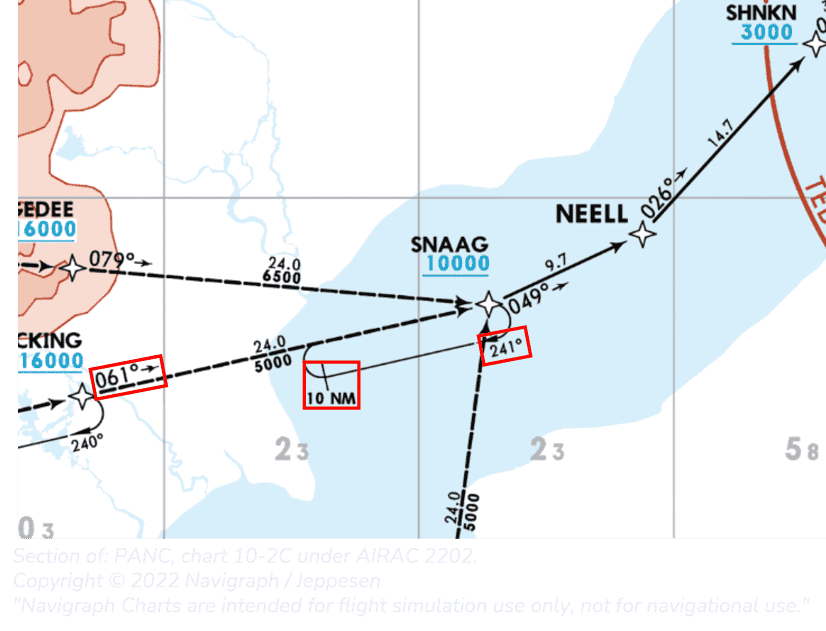
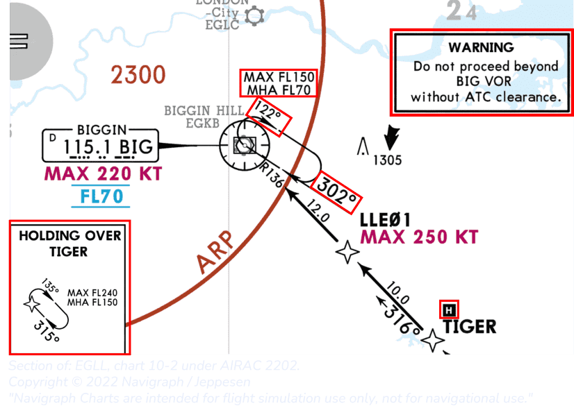
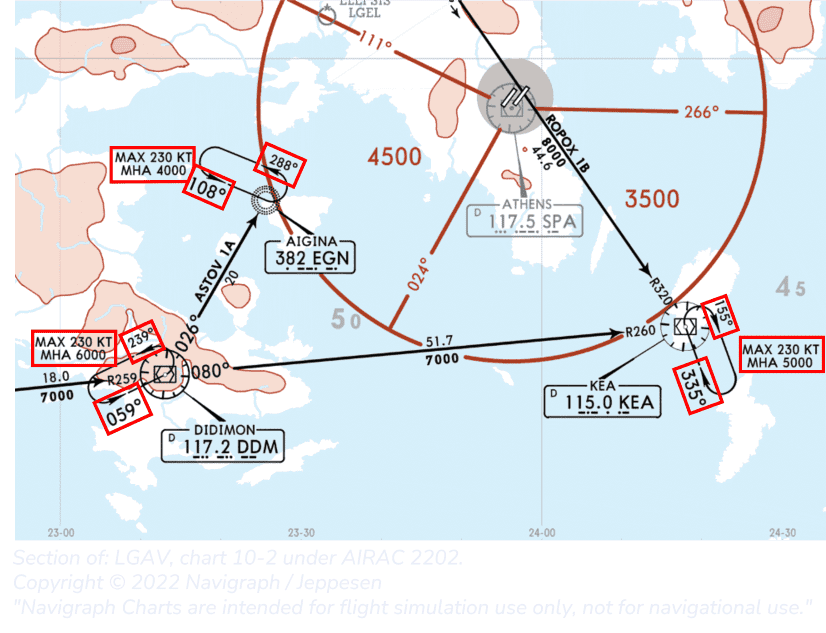

Known issues with page:

1. Table is too wide for page so it has a slider, need to get rid of slider
2. entry paterns are not discussed in depth, is this a issue? i (sven) dont think it belongs in this guide
3. Notes ,in the Example charts to aquire hold information, are a little faded ish. would like to make them bright white or some other more stand out color
4. Last exit is a little strangly positioned on the page now, i (sven) didnt quite know a better place unfortionatly
5. The [video of 320 Sim Pilot](#video-tutorial-by-320-sim-pilot) is embedded in the page at the bottom, there is no supporting text or copywrite thing, what is desired here?
6. The rank of titles is a little odd, please advise if there is a more logical solution here
7. A thorough spelling and grammar check has not yet been done by me
9. Images at [Leaving the hold](#leaving-the-hold) do not have any subscript, I (Sven) think it might be good to add a little supportive text there
8. Images are not yet optimized and the images are made in Powerpoint, I (Sven) have the powerpoint file to make changes to the figures.  Plan is to optimize after content of figure is good. Would it be helpfull to place the powerpoint file in the assets/hold directory? please let me know what is desired here.

Now the real page will start. 

# Holds

!!! warning "Not available in the Stable Version"

# Overview

Holding patterns, as they are officially known, can be used as a delaying tactic for airborne aircraft. Typically holding patterns have a racetrack pattern that can easily be spotted on flight trackers. All holds are made up out of segments, the segments are shown in the figure below. 

### Why Hold?
Holds are always used to delay aircraft near a navigational fix in certain airspace. There are a lot of reasons airplanes might need to hold, where common examples would be:

- Bad weather passing over the airport
- Traffic
- To lose energy in the plane (altitude or speed)
- To burn off fuel

Sometimes holds are used because of topographical constraints, Innsbruck-Kranebitten International Airport (LOWI) is a good example of such constraint because it is situated in a valley as can be seen in the picture below.

## Identifying Holds

Aircraft can technically hold at any waypoint if given permission by or requested from ATC in advance. Holds that are published on aviation charts are called published holds. For the purpose of this guide, we will only take a published hold into consideration. Holds can be identified on charts in 2 different ways, where both options can be applied on the same chart. For example look at the chart below.

Waypoints with published holds can be spotted by a racetrack pattern or holds can be published displayed in a diagram in one of the corners of the main navigation section on the chart. 

Now that you know where to hold, you should know how to program the hold. To do this you will need to find information on the chart to enter into the FMS. The main information you need to have is:

1. Name of the fix/waypoint
2. Inbound course
3. Turning direction
4. Length of the legs, eather in time or distance (see Standards below)
5. Maximum airspeed (see Standards below)

!!! tip "Standards"

There are standards for length of legs and airspeeds that have to be respected if no other information is present on the chart. The standards are published in [Hold Standards](#hold-standards).

 
 The inbound course/heading or the reciprocal of the hold is always depicted on the chart.

 Below you will find samples of different holds with red dots placed where the information is located.  

!!! info "Example charts to aquire hold information"

    === "1"

        

        

        | Fix           | Inbound course   |Turning direction   |Leg distance   |Max speed   |Max alt|Min Alt (MHA)  |
        | -----------   | -----------      |-----------         |  -----------  | --------   | ---   |-----          |
        | ARNUM         | 216°              |Right               | STD           | STD        |FL140  | FL100         |
      

        

    === "2"

        >**_NOTE:_**  The altitude constraints of the fix SUGOL are not relevant for the altitude constraints of the hold at SUGOL. The same principle applies to speed restrictions aswell.

        

        | Fix           | Inbound course   |Turning direction   |Leg distance   |Max speed   |Max alt|Min Alt (MHA)  |
        | -----------   | -----------      |-----------         |  -----------  | --------   | ---   |-----          |
        | SUGOL         | 110°              |Right               | STD           | STD        |FL250  | FL70          |
        
    === "3"

        

        

        | Fix           | Inbound course   |Turning direction   |Leg distance   |Max speed   |Max alt|Min Alt (MHA)  |
        | -----------   | -----------      |-----------         |  -----------  | --------   | ---   |-----          |
        | OKLAX         | 149°              |Left                | STD           | 210KT      |STD    | 8000FT        |

    === "4"

        >**_NOTE:_**  The design of the chart makes it confusing what the leg length is for the DVN hold. An argument could be made that this is 3.4 NM, however, 3.4 is just the length between the D11.0 SPL and the DVN fix and has no influence over the hold leg length.

        

        | Fix           | Inbound course   |Turning direction   |Leg distance   |Max speed   |Max alt|Min Alt (MHA)  |
        | -----------   | -----------      |-----------         |  -----------  | --------   | ---   |-----          |
        | DVN           | 053°              |Right               | STD           | 210KT      |-      | 2900FT        |
    
    === "5"

        >**_NOTE:_**  Holds at BOTON and PANZE have a mimimum hold altitude dictated by the minimum flight altitude 6000FT of the earlier and following legs. 

        

        | Fix           | Inbound course   |Turning direction   |Leg distance   |Max speed   |Max alt|Min Alt (MHA)  |
        | -----------   | -----------      |-----------         |  -----------  | --------   | ---   |-----          |
        | BOTON         | *049°             |Right               | STD           | STD        |-      | 6000FT        |
        | PANZE         | *049°             |Left                | STD           | STD        |-      | 6000FT        |
        | CAMRN         | 041°              |Left                | STD           | 210KT      |14000FT| 6001FT        |
        
        *The inbound course can be calulated by subtracting or adding 180 to the reciprocal.

    === "6"

        

        

        | Fix           | Inbound course   |Turning direction   |Leg distance   |Max speed   |Max alt|Min Alt (MHA)  |
        | -----------   | -----------      |-----------         |  -----------  | --------   | ---   |-----          |
        | SKENS         | 274°              |Right               | 10NM          | STD        |-      |13000FT        |

    === "7"

        

        

        | Fix           | Inbound course   |Turning direction   |Leg distance   |Max speed   |Max alt|Min Alt (MHA)  |
        | -----------   | -----------      |-----------         |  -----------  | --------   | ---   |-----          |
        | SNAAG         | 061°              |Right               | 10NM          | STD        |-      |-              |

    === "8"

        

        

        | Fix           | Inbound course   |Turning direction   |Leg distance   |Max speed   |Max alt|Min Alt (MHA)  |
        | -----------   | -----------      |-----------         |  -----------  | --------   | ---   |-----          |
        | TIGER         | 315°              |Right               | STD           | STD        |FL240  | FL150         |
        | BIG           | 302°              |Right               | STD           | STD        |FL150  | FL70          |
    
    === "9"

        

        

        |Fix            | Inbound course   |Turning direction   |Leg distance   |Max speed   |Max alt|Min Alt (MHA)  |
        | -----------   | -----------      |-----------         |  -----------  | --------   | ---   |-----          |
        | DDM           | 059°              |Left                | STD           | 230KT      |-      | 6000FT        |
        | EGN           | 108°              |Left                | STD           | 230KT      |-      | 4000FT        |
        | KEA           | 335°              |Right               | STD           | 230KT      |-      | 5000FT        |

    === "10"

        >**_NOTE:_**  The leg length for the CRS hold is presented as a distance from another naviagional beacon.

        

        |Fix            | Inbound course   |Turning direction   |Leg distance   |Max speed   |Max alt|Min Alt (MHA)  |
        | -----------   | -----------      |-----------         |  -----------  | --------   | ---   |-----          |
        | CRS           | 001°              |Left                |Until D34.0 CVO|STD|-   | FL120         |
     
## Hold Standards

STD leg distance is defined by the FAA to be:

| Altitude (MSL)    | Leg distance  |
|---------------    |---------------|
| MHA - 14000FT     | 1 minute      |
| 14001FT and above | 1.5 minutes   |

STD Max hold speed is defined by the FAA to be:

| Altitude (MSL)    | Airspeed (KIAS) |
|---------------    |-----------------|
| MHA - 6000FT      | 200             |
| 6001FT - 14000FT  | 230             |
| 14001FT and above | 265             |

## Programming Holds 
Now that all information of the hold is known it is time to create a hold in the FMS via the MCDU. A step by step guide to hold at SKENS as with example chart 6 (above) is provided below.

### MCDU Setup

!!! info "MCDU Setup"

    === "1"

        

        Find the waypoint in the F-PLN page on the MCDU. Select the corresponding line. In this case the 3rd from the top, SKENS, and push the left line selector key (LSK) for SKENS.

    
    === "2"

        

        In this page select the 3rd LSK to enter the hold section for the SKENS waypoint.

    === "3"

        

        Notice the title of the page is called COMPUTED HOLD at SKENS. 
        
        Computed means that this is information provided from the simulator. This information can be wrong, and can be edited by overwriting the computed information. 

    === "4"
        

        As can be seen by the bigger symbols, the inbound course 274 is inserted in the FMS
        
        Note that the title has changeed to HOLD and a REVERT TO COMPUTED appeared.  REVERT TO COMPUTED will restore all hold settings and revert back to the computed hold settings.

    === "5"

        

        As can be seen in the chart, the hold has a leg length of 10NM. To enter this in the FMS type `/10` in the MCDU and select LSK3 to feed it in the TIME/DIST box. 
        The time needed to complete the leg is also re-calculated and is 3.3 minutes in this case. 

        If leg distance is constrained by time (as it is for a standard hold) this can be set by typing for example 1.5 in the MCDU and feeding it in the TIME/DIST box. Also now, the leg distance will automatically be re-calculated.

        

    

    === "Last Exit"

        !!! warning "Not yet implemented"

        

        In the bottom section of the MCDU screen 'LAST EXIT' can be found. The section compromises of a UTC and FUEL reading. Last exit gives information on how long the airplane can safely stay in the hold while still having the fuel for the rest of the approach, to go around, divert and the final reserve fuel. The UTC and FUEL will give you the time and the minium fuel respectively needed when leaving the hold. 

    === "6"

        

        If the inbound course, turning direction and leg distance are set correctly press the 6th LSK on the right to insert the hold into the Flight plan. 

        Notice the white curved arrow in the ND. In this case it is turned to the right, however, if a left turn hold is selected the arrow would turn to the left.   
        Also notice how the hold waypoint now appears for an additional time in the flight plan. This is needed for the FMS to calculate a good exit path when leaving the hold.

        Holds need to be entered in diffrent ways with diffrent inbound courses. The A320 will automatically fly the correct entering pattern.

    === "7"
        
        
        As soon as the aircraft is heading to the waypoint with the hold programmed the hold will be calculated and completely shown on the ND.  

    === "8"
        

        When the aircraft passes the hold fix for the first time (entering the hold) the airplane will fly at green dot speed. The green dot speed is the speed at which the A320 can stay airborne while using the minimum amount of fuel per hour making. 

        Also, the F-PLN page on the MCDU will now show IMM EXIT*. This is needed when [leaving the hold](#leaving-the-hold).

### Descending in the Hold
Altitude changes are done with the vertical speed mode set at 1000 ft/min. This is to make sure all aircraft are spaced out enough to comply with spacing safety standards/

The TCAS system should remain on TA/RA when flying in the hold, however it might be convenient to switch to ALL or BLW.

### Leaving the Hold

The plane will continue to fly in the hold until a pilot gives the command to the FMS to leave. During the hold the F-PLN page will display IMM EXIT in amber. To leave the hold the pilot has to press the right LSK next to IMM EXIT. The amber text will now change in RESUME HOLD. The aircraft will complete the remaining hold lap and continue its flightplan when it reaches the hold fix again. 

# Video Tutorial by 320 Sim Pilot

<iframe width="826" height="465" src="https://www.youtube.com/embed/NYlSICln1So" title="YouTube video player" frameborder="0" allow="accelerometer; autoplay; clipboard-write; encrypted-media; gyroscope; picture-in-picture" allowfullscreen></iframe>
